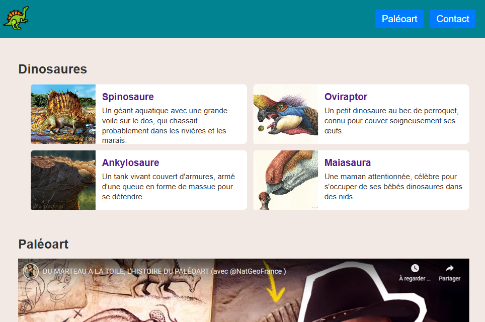
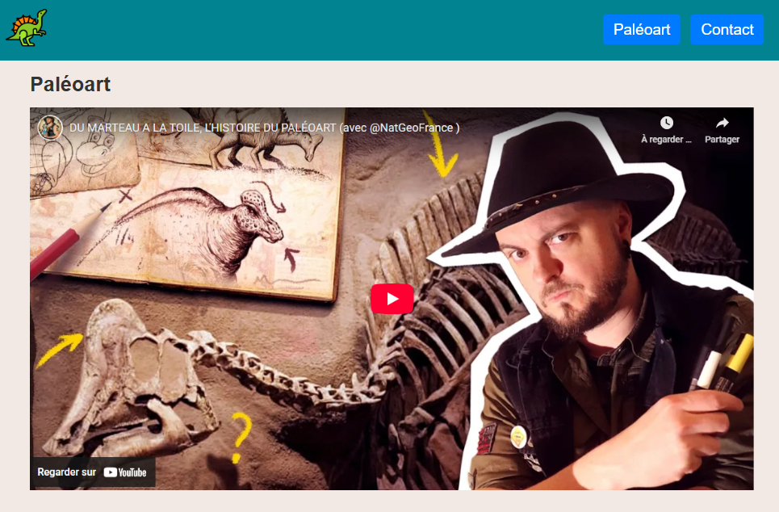
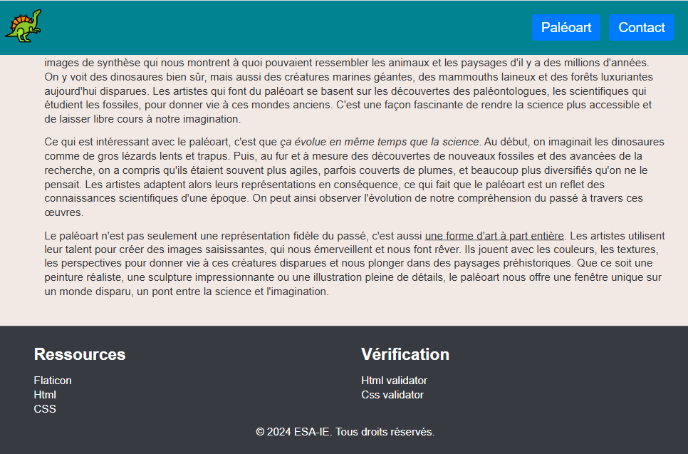
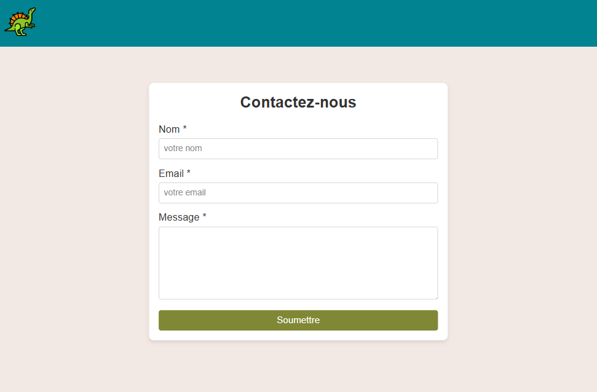

# 🦖 Site Vitrine sur les Dinosaures

Ce dépôt contient le code source d'un site vitrine sur les dinosaures, développé dans le cadre de l'examen de Web Principe en première année de Bachelier en Informatique (orientation développement d'applications).

## 🌍 Objectif

Ce dépôt est principalement pour mon usage personnel. Cela me permet de conserver et centraliser les différentes notions abordées en cours sous forme de fichiers Python, afin de faciliter la révision et la pratique.


## 📌 Technologies utilisées

HTML : Structure du site

CSS : Mise en page et styles


## 🎨 Fonctionnalités du site

Cartes de présentation de différentes espèces de dinosaures

Vidéo sur le Paléoart

Formulaire de contact


## 📸 Voici un aperçu du site :

### Cartes dinosaure


### Vidéo Paléoart


### Texte sur les dinosaures et footer


### Formulaire de contact



## Clonez ce dépôt en local avec la commande :

```
git clone https://github.com/Carole-GRD/ESA-WEB_Principes-Exam_Janvier.git
```

Ouvrez ensuite le fichier index.html dans votre navigateur pour explorer le site.


## 📌 Auteur : 

Carole, étudiante en première année de Bachelier en Informatique (orientation développement d'applications) à Namur, Belgique.
